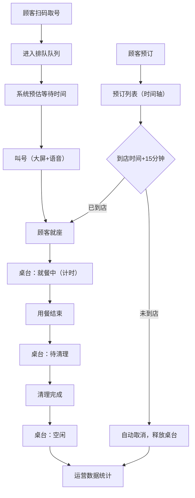

## 1. 产品概述

餐厅前厅运营管理面板是一个面向餐厅管理者和前厅服务员的实时运营监控与管理系统。通过数字化管理排队叫号、预订接待、桌台状态追踪和运营数据统计，提升餐厅运营效率和顾客体验。

- 目标用户：餐厅店长、前厅经理、领位员、服务员
- 核心价值：实时掌握前厅运营状态，优化翻台效率，减少顾客流失

## 2. 核心功能

### 2.1 用户角色

| 角色 | 核心权限 |
|------|----------|
| 店长/经理 | 查看全部模块、叫号操作、预订管理、运营数据统计 |
| 领位员 | 排队叫号、预订查看、桌台状态更新 |
| 服务员 | 桌台状态查看、用餐时长查看 |

### 2.2 功能模块

1. **排队管理模块**：桌型分类排队队列、实时叫号、大屏显示、语音播报
2. **预订管理模块**：今日预订日历、时间段排布、超时自动取消、桌台释放
3. **翻台看板模块**：桌台平面图、状态可视化、用餐时长实时显示
4. **运营数据统计**：翻台率、平均用餐时长、等位流失率实时计算

### 2.3 页面详情

| 页面名称 | 模块名称 | 功能描述 |
|-----------|-------------|---------------------|
| 主控制面板 | 排队管理 | 展示小桌/中桌/大桌/包厢四列排队列表，显示排队号、等待人数、预估等待时间，支持叫号、过号、取消操作 |
| 主控制面板 | 叫号大屏 | 弹窗/全屏显示当前叫号信息，配合语音播报功能 |
| 主控制面板 | 预订管理 | 日历时间轴视图展示今日预订，按时间段排列，显示客户信息、桌型、人数、到店状态，超时15分钟自动取消 |
| 主控制面板 | 翻台看板 | 餐厅平面图展示所有桌台，用不同颜色标识：空闲（绿）/就餐（蓝）/待清理（橙）/已预订（紫），就餐桌台显示已用餐时长 |
| 主控制面板 | 运营统计 | 顶部数据卡片展示今日翻台率、平均用餐时长、等位流失率，实时更新 |

## 3. 核心流程

顾客扫码取号 → 进入对应桌型排队队列 → 系统实时预估等待时间 → 前厅人员叫号 → 大屏显示+语音播报 → 顾客到店就座
↓
顾客提前预订 → 系统记录预订信息 → 到店前15分钟提醒 → 超时15分钟未到自动取消释放桌台
↓
顾客就座 → 桌台状态变为"就餐"并开始计时 → 用餐结束 → 桌台状态变为"待清理" → 清理完成 → 桌台状态变为"空闲"
↓
系统实时统计：翻台率 = 当日总用餐次数 / 总桌台数；平均用餐时长；等位流失率 = 离队人数 / 总取号人数

## 4. 用户界面设计

### 4.1 设计风格

- **主色调**：深邃藏青 #1e293b（专业稳重）搭配暖橙 #f97316（活力热情，餐饮行业代表色）
- **辅助色**：成功绿 #10b981（空闲）、业务蓝 #3b82f6（就餐）、警示橙 #f59e0b（待清理）、预订紫 #8b5cf6
- **字体**：标题使用思源宋体（优雅），正文使用思源黑体（易读），数字使用等宽字体
- **布局**：顶部导航栏 + 左侧排队区 + 中间翻台看板 + 右侧预订区的仪表盘布局
- **卡片风格**：圆角 12px，微阴影，悬停浮起效果
- **图标**：线性图标，统一 24px 尺寸

### 4.2 页面设计概览

| 模块 | UI元素 | 设计要点 |
|-----------|-------------|-------------|
| 顶部统计栏 | 数据卡片、实时时钟 | 渐变背景，数字大号加粗，趋势指标微动画 |
| 排队管理 | 四列桌型分类、排队列表、叫号按钮 | 队列头高亮显示，叫号按钮脉冲动画 |
| 翻台看板 | 桌台平面图、状态颜色块、时长标签 | 按真实餐厅布局排列，状态颜色一目了然 |
| 预订管理 | 时间轴、预订卡片、状态标签 | 按时间垂直排列，超时预订红色警示 |
| 叫号大屏 | 大号叫号数字、桌型提示 | 深色背景，大号数字闪烁动画 |

### 4.3 响应式

桌面端优先设计（1440px+），支持横向分栏布局。中等屏幕自动折叠为上下布局，小屏设备（平板）保持核心功能可用。
