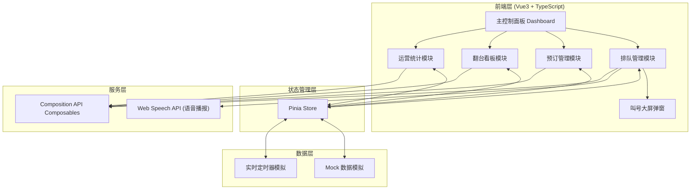
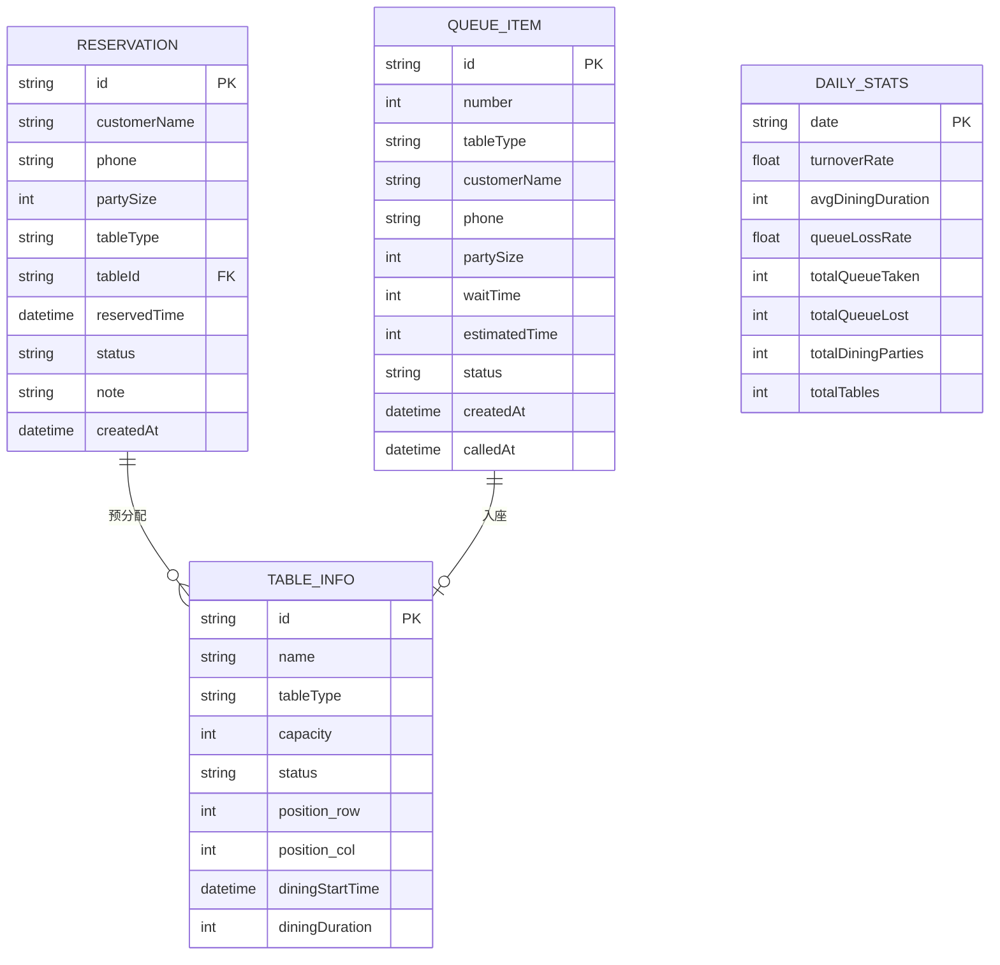

## 1. 架构设计



## 2. 技术说明

- **前端框架**：Vue 3 + TypeScript + Vite
- **UI 样式**：TailwindCSS 3
- **状态管理**：Pinia
- **路由**：Vue Router 4（单页面应用，可预留路由扩展）
- **图标库**：lucide-vue-next
- **后端**：无（纯前端 Mock 数据模拟）
- **语音播报**：Web Speech API (SpeechSynthesis)

## 3. 目录结构

```
d:\proje\label-074/
├── src/
│   ├── components/
│   │   ├── queue/              # 排队模块组件
│   │   │   ├── QueueColumn.vue      # 单列排队列表
│   │   │   ├── QueueCard.vue        # 单条排队卡片
│   │   │   └── CallScreen.vue       # 叫号大屏弹窗
│   │   ├── reservation/        # 预订模块组件
│   │   │   ├── ReservationList.vue  # 预订时间轴列表
│   │   │   └── ReservationCard.vue  # 预订卡片
│   │   ├── floor/              # 翻台看板组件
│   │   │   ├── FloorPlan.vue        # 桌台平面图
│   │   │   └── TableCard.vue        # 单桌状态卡片
│   │   └── stats/              # 统计模块组件
│   │       └── StatsHeader.vue      # 顶部统计卡片
│   ├── composables/            # 可复用逻辑
│   │   ├── useTimer.ts             # 计时器逻辑
│   │   ├── useSpeech.ts            # 语音播报逻辑
│   │   └── useMockData.ts          # 模拟数据逻辑
│   ├── stores/                 # Pinia 状态管理
│   │   ├── queue.ts               # 排队状态
│   │   ├── reservation.ts         # 预订状态
│   │   ├── table.ts               # 桌台状态
│   │   └── stats.ts               # 统计状态
│   ├── types/                  # TypeScript 类型定义
│   │   ├── queue.ts
│   │   ├── reservation.ts
│   │   ├── table.ts
│   │   └── stats.ts
│   ├── mock/                   # Mock 数据
│   │   ├── queue.ts
│   │   ├── reservation.ts
│   │   └── tables.ts
│   ├── App.vue
│   └── main.ts
├── index.html
├── vite.config.ts
├── tailwind.config.js
├── tsconfig.json
└── package.json
```

## 4. 数据模型

### 4.1 排队模型 (Queue)

```typescript
type TableType = 'small' | 'medium' | 'large' | 'private';

interface QueueItem {
  id: string;
  number: number;           // 排队号，如 A001, B001
  tableType: TableType;     // 桌型
  customerName: string;     // 顾客称呼
  phone: string;            // 手机号
  partySize: number;        // 用餐人数
  waitTime: number;         // 已等待时长（分钟）
  estimatedTime: number;    // 预估等待时长（分钟）
  status: 'waiting' | 'called' | 'seated' | 'cancelled' | 'missed';
  createdAt: Date;
  calledAt?: Date;
}
```

### 4.2 预订模型 (Reservation)

```typescript
interface Reservation {
  id: string;
  customerName: string;
  phone: string;
  partySize: number;
  tableType: TableType;
  tableId?: string;         // 预分配桌台
  reservedTime: Date;       // 预订时间
  status: 'pending' | 'arrived' | 'cancelled' | 'expired';
  note?: string;
  createdAt: Date;
}
```

### 4.3 桌台模型 (Table)

```typescript
type TableStatus = 'idle' | 'dining' | 'cleaning' | 'reserved';

interface TableInfo {
  id: string;
  name: string;             // 桌台号，如 A1, B2
  tableType: TableType;
  capacity: number;         // 容纳人数
  status: TableStatus;
  position: { row: number; col: number };  // 平面图位置
  diningStartTime?: Date;   // 开始用餐时间
  diningDuration?: number;  // 已用餐时长（分钟）
  currentParty?: {
    customerName: string;
    partySize: number;
  };
}
```

### 4.4 统计模型 (Stats)

```typescript
interface DailyStats {
  date: string;
  turnoverRate: number;     // 翻台率
  avgDiningDuration: number; // 平均用餐时长（分钟）
  queueLossRate: number;    // 等位流失率
  totalQueueTaken: number;  // 总取号数
  totalQueueLost: number;   // 流失数（取消+过号）
  totalDiningParties: number; // 今日总用餐桌数
  totalTables: number;      // 总桌台数
}
```

### 4.5 数据关系 ER 图



## 5. 核心业务逻辑

### 5.1 排队叫号逻辑
- 按桌型（small/medium/large/private）分为四个独立队列
- 叫号：取出队列首位，状态改为 called，触发语音播报和大屏显示
- 过号：被叫后3分钟未确认，状态改为 missed，可选择重排
- 入座：状态改为 seated，桌台状态改为 dining，从队列移除

### 5.2 预订自动取消逻辑
- 定时器每 30 秒检查一次预订列表
- 若 `now > reservedTime + 15分钟` 且 status 为 pending
- 自动将状态改为 expired，释放预分配桌台

### 5.3 翻台统计逻辑
- **翻台率** = totalDiningParties / totalTables（实时计算）
- **平均用餐时长** = 所有已完成用餐的时长总和 / 已完成用餐数
- **等位流失率** = totalQueueLost / totalQueueTaken * 100%

### 5.4 用餐时长计时
- 桌台状态变为 dining 时记录 diningStartTime
- 每 60 秒更新所有 dining 状态桌台的 diningDuration
- 显示格式：小时:分钟
